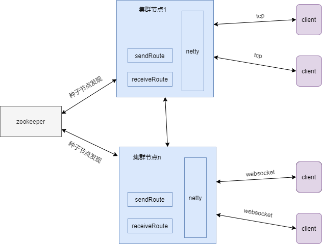
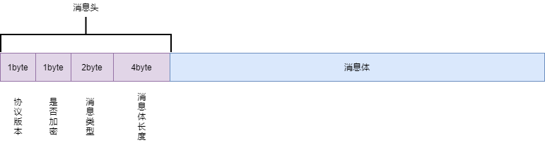

# yue-im

#### 介绍
   YUE-IM 是使用java开发，基于netty,akka 实现的即时通讯服务。并且提供极简的api，极大的降低开发难度，方便使用者二次开发。

#### 主要特点：
 1. 支持websocket，tcp协议进行通信,消息类型代码，消息内容格式自定义
 2. 支持单机部署，集群部署
 3. 提供极简api，方便开发者二次开发
 4. 得益于akka提供的能力，集群模式只需要简单配置（依赖zookeeper，用于种子节点发现），支持自组建，集群间消息通信不依赖其他消息队列及其他中间件
 5. 支持同一账号，多终端连接，多终端同时接收消息
#### 软件架构

>
   系统选择基于使用netty作为接入服务器，主要是考虑netty作为java里最知名的网络服务器框架，性能，对多种协议的支持，以及开发资料都有保证
>
 集群间通信：
       系统集群间通信选择基于Akka来实现，即时通讯集群要解决的最大的问题就是如何把消息投递到目的客户端连接的节点上，目前大部分开源的即时通讯项目基本上都是基于消息队列或者redis的发布订阅来实现跨节点的通信，
       或者是维护一个总的路由缓存系统来实现跨节点的通信，本系统基于Akka，通过广播，消息应答及各节点缓存路由来实现集群各节点的通信，不依赖其他系统或中间件，尽量减少不必要的设备资源消耗及网络传输次数，
       Akka是一套开源工具和运行时，便于构建JVM上的并发应用和分布式应用，自从了解Akka后就一直想基于Akka开发
 一个程序，无奈平时并没有什么应用场景用得到，Akka本身的特性是很适合做这种消息服务的，所以选择了Akka，并且集群节点间通信使用protobuf，提高数据传输效率
   
#### 代码结构
```shell
├── imui #示例项目前端测试demo
├── yueim-common # 接口定义,通用配置，依赖
├── push-sample # 示例项目:即时通讯服务器节点，需部署启动
├── push-server # 即时通讯服务框架，依赖

```
#### 默认协议结构
  - tcp连接：
    
  - websocket连接
    websocket连接协议实现的比较简单，走的文本帧
    
    ```
       消息类型代码 + "#" + json文本消息体
    ```
#### 使用说明
      yueim-sample : 本地启动ImApplication,访问imui下的index.html页面即可使用demo，完整项目开发完成后放到其他仓库
        示例项目完成了 私聊，群聊，（多媒体，历史消息属于业务范畴，需要自行实现）
   
  如果开发者想基于本系统开发自己的即时通讯服务，大部分时间只需要实现消息处理器CmdHandler的回调接口即可：
  ```
     /**
      * 处理消息前的回调，比如敏感词检测
      * @param msgType 消息类型代码
      * @param message 消息体
      * @param msgId 系统生成的唯一消息id
      * @return 如果返回false，后续的回调函数将不会执行
      */
      boolean preMessage(int msgType, byte[] message, long msgId);
 
     /**
      *  服务器处理消息的回调，处理消息
      * @param ctx 消息服务上下文
      * @param msgType 消息类型代码
      * @param message 消息体
      * @param msgId 系统生成的唯一消息id
      */
     void onMessage(ImContext ctx, int msgType, byte[] message, long msgId);
 
    /**
     * 处理完消息后的回调(响应客户端后触发)，比如保存消息到数据库(该回调方法在异步线程内被执行，不会影响消息处理)
     * @param ctx 消息服务上下文
     * @param msgType 消息类型代码
     * @param message 消息体
     * @param msgId 系统生成的唯一消息id，雪花算法生成
    */
     void postMessage(ImContext ctx, int msgType, byte[] message,long msgId);
  ```
  #### 消息服务context
      在回调里可以调用 ImContext 提供的几个方法发送消息
      /**
          * 客户端与服务器正式建立连接,可在登录成功时调用
          * @param userId 用户id
          * @param device 终端id
          */
         public void connect(String userId,String device);
         
       /**
           *  发送单点消息
           * @param msgId  系统生成的唯一消息id，雪花算法生成
           * @param msg 消息内容
           * @param msgType 消息类型码
           * @param to  接收者id
           */
          public void sendPointMsg(long msgId,String msg,int msgType,String to);
       
        /**
            *  发送群组消息
            * @param msgId 系统生成的唯一消息id，雪花算法生成
            * @param msg 消息内容
            * @param msgType 消息类型码
            * @param groupId 群组id
            */
           public void sendGroupMessage(long msgId,String msg,int msgType,String groupId);
           
        /**
        * 服务器给连接的终端发送消息
        * @param msgType 消息类型
        * @param msg 消息内容
        */
          public void sendToClient(int msgType,String msg)
          
          
          
  可以按照以下的步骤实现：
1. 新建一个自己的maven项目
2. 依赖yueim-server模块,实现自己的消息处理器
```
    <dependency>
                <groupId>com.yueya</groupId>
                <artifactId>yueim-server</artifactId>
                <version>1.0-SNAPSHOT</version>
    </dependency>
```
3. 初始化并启动服务(集群模式记得启动zookeeper)
 `ClusterNodeApp.start("akka.conf",setting);` 在启动服务前，需要初始化设置
 其中akka.conf是节点配置文件，拷贝示例工程yueim-node里的即可
 setting为业务配置类:
  开发者需要实现以下几个接口：
   1. BusinessInfoProvider接口，开发者需要实现 提供好友id，群组成员id查询服务的接口
   2. setting.setHandlerMap(Map<String, CmdHandler>) 设置消息类型码(注意：0-10为系统保留的消息类型码，请不要使用)及对应消息类型的处理器类实例
   3. 关键配置说明，详情见示例工程yueim-node
   ```
   akka {
     remote {
       netty.tcp {
         hostname = "127.0.0.1"  //  节点IP地址
         port = 2551  //节点集群通信端口
       }
     }
     cluster {
     	roles = ["worker"]
     }
     netty{
       port = 8088  // 终端连接端口
       mode = websocket  //服务模式,tcp:tcp协议节点;websocket:websocket协议节点
       heart_beat = true //是否启用心跳检测，心跳检测间隔20s,心跳超时超过3次，则断开该客户端连接
     }
     zookeeper{
       ip = 127.0.0.1  // zookeeper ip地址
     }
   
     # cluster,single
     node{
       mode = cluster  // 节点运行模式，cluster:集群模式; single:单机模式
     }
   }
    
   ```
5. 如果需要修改消息协议结构，需要修改yueim-server中的相应类
>
  tcp协议修改：TcpMsgDecoder类
>
  websocket协议修改：WebSocketServerHandler类
   
#### 示例项目

  
   体验地址的项目 和sample不一样（前端写比较简陋，请不要在意） ：http://47.102.218.172:8099/im/login.html 测试账号 admin/123456;test/123456,
   需要更多账号测试的话 可以使用admin/123456 登录 http://47.102.218.172:8099/#/user/login 用户管理里添加用户
#### 安装教程

1. 参考yueim-node 项目的pom.xml配置，运行package命令后，打包出相应的tar.gz
2. 解压xxx.tar.gz
3. 根据相应的操作系统，运行bin目录下的相应的启动脚本


#### 参与贡献

1. Fork 本仓库
2. 新建 Feat_xxx 分支
3. 提交代码
4. 新建 Pull Request
